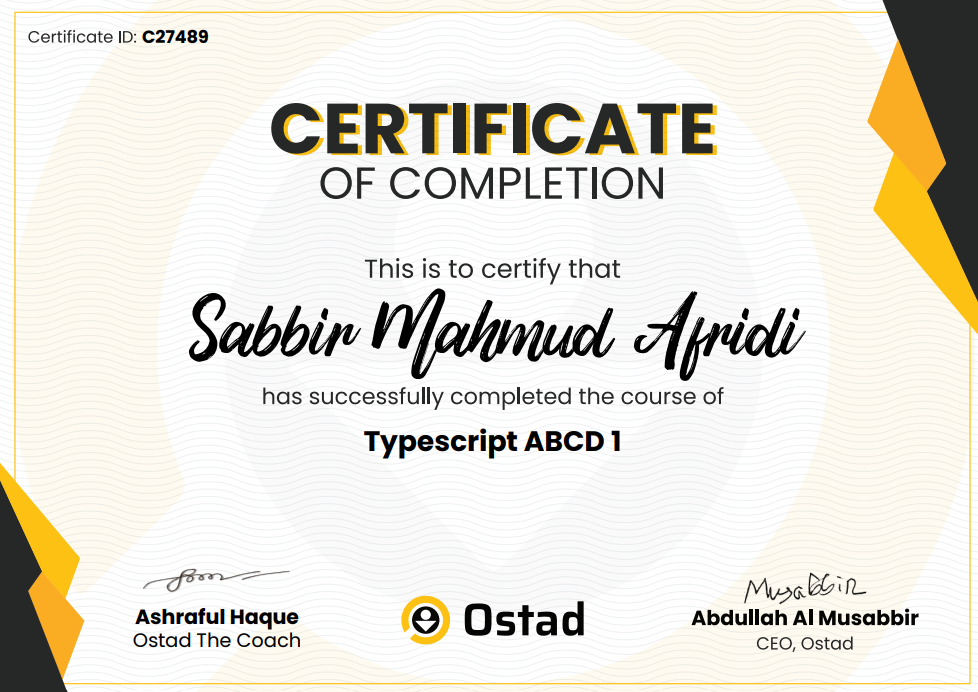

# To-Do List

This project is a simple to do list app built while learning TypeScript.

## TypeScript Course Completion

I have successfully completed the **Typescript ABCD 1** course offered by **Ostad**. This course has equipped me with foundational and advanced knowledge of TypeScript, enhancing my ability to build robust and scalable applications.

### Certificate of Completion

Below is a preview of the certificate:
 

*(If you've placed the image elsewhere or named it differently, please update the path above.)*

### Certificate Details:

*   **Recipient:** Sabbir Mahmud Afridi
*   **Course:** Typescript ABCD 1
*   **Issuing Organization:** Ostad
*   **Certificate ID:** C27489
*   **Verification Link:** [View Certificate Online](https://ostad.app/share/certificate/c27489-sabbir-mahmud-afridi)

---

## About This Project

*(You can expand this section with more details about your specific project, how to run it, its features, etc. The content below is a generic placeholder based on the To-Do app we discussed earlier. Adjust as needed.)*

### Features (Example for a To-Do App)
*   Add new tasks
*   Mark tasks as complete/incomplete
*   Delete tasks
*   Persistent storage using browser's localStorage
*   Tasks sorted by completion status and creation date

### Technologies Used (Example)
*   React
*   TypeScript
*   Tailwind CSS
*   HTML5

### Getting Started (Example)
1. Clone the repository.
2. Ensure you have a local web server to serve `index.html` (e.g., using `npx serve` or Python's `http.server`).
3. Open the application in your browser.

